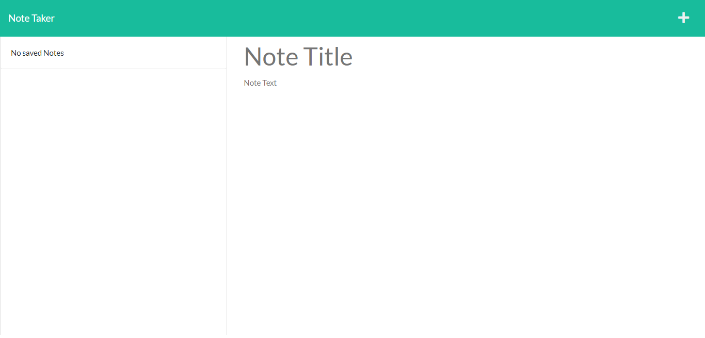
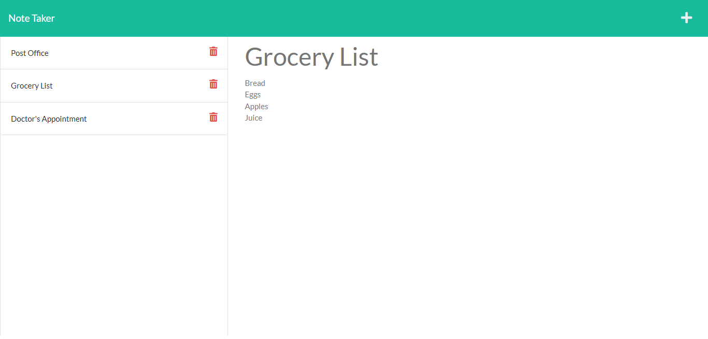

# Note Taker

[Live Site](https://quiet-springs-32410.herokuapp.com/)

## Table of Contents

- [Description](#description)
- [Usage](#usage)
- [Visuals](#visuals)
- [Future Development](#future-development)

## Description

The Note Taker application saves notes that are added by the user. Each note has a title and related text (where tasks are recorded). Notes are saved for the use of the user.

This application was created with starter code provided by the UNCC Web Development Bootcamp. I was able to build the back end and connect it to the front end using [express.js](https://expressjs.com/).

## Usage

Users who want to save notes, from business owners to students, can use this application to keep track of tasks. When you open up the Note Taker, click 'Get Started' to go to the notes page. On the notes page, enter a note title and text and click the save button in the upper right hand corner. Previous notes can be accessed by clicking their title in the left side column. Add a new note by clicking the '+' in the upper right hand corner.

## Visuals

## Future Development

In the future, I would like to add functionality to the delete buttons next to the notes.
